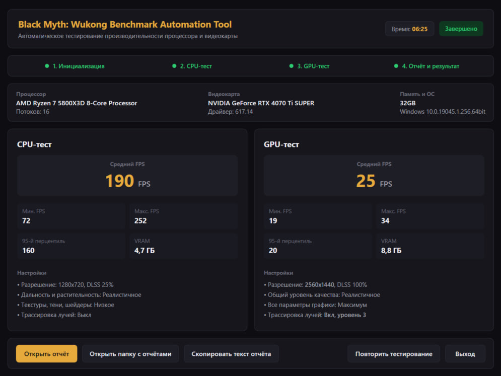

# Black Myth: Wukong  Benchmark Automation Tool

[](https://dotnet.microsoft.com/)
[](https://learn.microsoft.com/dotnet/csharp/)
[](https://www.microsoft.com/windows)
[](https://xunit.net/)
[](https://store.steampowered.com/app/3132990/Black_Myth_Wukong_Benchmark_Tool/)

Инструмент проводит два последовательных прогона, CPU-тест и GPU-тест, считывает результаты, проверяет корректность применения графических параметров, выводит форматированный отчёт в консоль и сохраняет его в текстовый файл. Для удобства работы доступны как консольная версия, так и графический интерфейс.


## Оглавление

1. [Что умеет приложение](#что-умеет-приложение)
2. [Графический интерфейс](#графический-интерфейс)
3. [Системные требования и подготовка](#системные-требования-и-подготовка)
4. [Инструкция по запуску](#инструкция-по-запуску)
5. [Как выполнялась работа](#как-выполнялась-работа)
6. [Методология подбора профилей тестирования](#методология-подбора-профилей-тестирования)
7. [Архитектура решения](#архитектура-решения)
8. [Пример итогового отчёта](#пример-итогового-отчёта)

## Что умеет приложение

- Запуск бенчмарка пропускает начальное меню с помощью аргумента запуска Unreal Engine 5 `-benchmark`
- Утилита самостоятельно находит путь к исполняемому файлу Steam через реестр Windows и сканирует все библиотеки установки игр через `libraryfolders.vdf`
- Для корректной установки нативного разрешения в GPU-тесте используется Win32 API. Это нужно, чтобы определять истинное физическое разрешение основного монитора в пикселях даже при включённом системном масштабировании (125%, 150%, 200%)
- Модификация `GameUserSettings.ini` учитывает внутреннее устройство настроек игры - синхронно обновляются секции `UISettingData` и `[ScalabilityGroups]`, отключается V-Sync и лимит частоты кадров
- Перед началом тестирования создаётся резервная копия оригинального файла настроек (`.bak_wukong_automation`), которая позже восстанавливается по завершению прогона, при сбоях или аварийном прерывании.
- Если по результатам первого теста видеокарта определяется как NVIDIA RTX, в GPU-тесте автоматически активируется максимальный уровень трассировки лучей
- Классический консольный режим и графический оконный интерфейс

## Графический интерфейс

В [релизах](https://github.com/ProDexortie/wukong-benchmark-automation/releases/latest) графический интерфейс поставляется отдельным исполняемым файлом `WukongBenchmarkAutomation.Gui.exe` - его можно запускать привычным двойным кликом без необходимости открывать терминал.



### Особенности графической версии:
- Тестирование выполняется в фоновом потоке (`async/await`), интерфейс остаётся отзывчивым во время всех этапов работы.
- Пошаговое отображение текущего прогресса (инициализация, CPU-тест, GPU-тест, отчёт) с выводом логов в реальном времени.
- Раздельное отображение ключевых показателей CPU- и GPU-тестов вместе со списком применённых настроек графики.
- Автоматическое определение и вывод моделей CPU, GPU, версии видеодрайвера, объёма RAM и версии Windows.
- Ккнопки для быстрого копирования текста отчёта в буфер обмена, открытия текстового файла отчёта и перехода в каталог `reports/`.
- Возможность в любой момент остановить прогон по кнопке «Прервать» или закрытию окна - оригинальные настройки игры гарантированно восстанавливаются.

## Системные требования и подготовка

### Требования к окружению
- Операционная система Windows 10 / Windows 11 (x64)
- Среда выполнения [.NET 10.0 SDK](https://dotnet.microsoft.com/download/dotnet/10.0) или .NET 10.0 Desktop Runtime
- Клиент Steam запущен или установлен в системе
- Бенчмарк установлен [Black Myth: Wukong Benchmark Tool](https://store.steampowered.com/app/3132990/Black_Myth_Wukong_Benchmark_Tool/)

Перед первым запуском утилиты автоматизации необходимо хотя бы один раз запустить бенчмарк вручную через Steam:
1. Дождаться первичной компиляции шейдеров.
2. Пройти базовую настройку яркости и языка.
3. Принять/отклонить лицензионное соглашение и политику cookie.
4. Выйти из игры.

> До первого ручного запуска каталог конфигурации `b1\Saved\Config\Windows\` пуст, а файл `GameUserSettings.ini` ещё не сгенерирован движком.

## Инструкция по запуску

### 1. Клонирование и переход в каталог
```bash
git clone https://github.com/ProDexortie/wukong-benchmark-automation.git
cd wukong-benchmark-automation
```

### 2. Запуск через .NET CLI
Стандартный запуск через консоль:
```bash
dotnet run --project src/WukongBenchmarkAutomation
```

Запуск графического интерфейса (GUI):
```bash
dotnet run --project src/WukongBenchmarkAutomation.Gui
```

### 3. Ручное указание каталога игры (опционально)
Если бенчмарк установлен в нестандартном месте, путь к игре можно передать аргументом `--game-dir`:
```bash
dotnet run --project src/WukongBenchmarkAutomation -- --game-dir "D:\Games\SteamLibrary\steamapps\common\Black Myth Wukong Benchmark Tool"
```

### 4. Запуск скомпилированных .exe
Готовые автономные сборки доступны на странице **[Releases](https://github.com/ProDexortie/wukong-benchmark-automation/releases/latest)**:
- **`WukongBenchmarkAutomation.exe`** - классическая консольная версия.
- **`WukongBenchmarkAutomation.Gui.exe`** - графическая версия с оконным интерфейсом для тех, кому привычнее запускать программы кликом мыши.

Для запуска скачайте нужный файл и откройте его двойным кликом. По завершении работы консольной версии окно остаётся открытым до нажатия любой клавиши.

## Как выполнялась работа

Для решения задачи автоматизации был проведён предварительный анализ поведения инструмента, архитектуры движка Unreal Engine 5 и системных компонентов Windows.

Перед началом написания кода были сформулированы 5 исследовательских задач:
1. Изучить поведение инструмента в ручном сценарии
2. Определить, куда необходимо записывать настройки графики
3. Определить, куда бенчмарк записывает результаты прогонов для их последующего парсинга
4. Найти оптимальный способ запуска бенчмарка без участия пользователя
5. Автоматизировать алгоритм и реализовать его в коде

### Этап 1. Изучение поведения в ручном сценарии
Исследование началось с установки официального Black Myth: Wukong Benchmark Tool в Steam и проведения ручного тестового прогона.

Были выявлены следующие особенности:
- Сразу после чистой установки в папке игры отсутствуют конфигурационные файлы
- При первом запуске движок выполняет компиляцию шейдеров, предлагает принять политику конфиденциальности/cookie, настроить гамму и язык
- В результате этого в подкаталоге `b1\Saved\Config\Windows\` создаётся целевой конфигурационный файл - `GameUserSettings.ini`
- При последующих стандартных запусках игра всегда останавливается на приветственном экране "Нажмите любую кнопку...", после чего открывает главное меню с пунктом "Тест быстродействия".

### Этап 2. Выбор способа запуска бенчмарка
Классический подход к автоматизации через эмуляцию ввода имеет недостатки: нестабильность при смене разрешения, чувствительность к задержкам загрузки и потере фокуса окна.

Исходя из игрового опыта и понимания архитектуры игр со встроенными бенчмарками у меня возникла гипотеза: у движка должен существовать специальный аргумент командной строки для прямого запуска теста.

Анализ официальной документации [Epic Games: Unreal Engine Command-Line Arguments](https://dev.epicgames.com/documentation/unreal-engine/command-line-arguments-in-unreal-engine) подтвердил наличие специализированного аргумента:
```text
-benchmark
```
Проверка гипотезы через параметры запуска в Steam подтвердила предположение: флаг `-benchmark` запускает инструмент напрямую в режиме прогона теста быстродействия, минуя приветственный экран и меню.

### Этап 3. Подбор настроек
Было проведено исследование влияния различных параметров рендеринга на компоненты ПК. Для контроля нагрузки на CPU и GPU в реальном времени использовалась утилита MSI Afterburner:
- Было установлено, что параметры плотности растительности и дальности прорисовки генерируют наибольшее количество вызовов отрисовки и существенно нагружают процессорные потоки, включение только их минимизирует влияние производительности видеокарты на результат
- Разрешение экрана, масштаб рендеринга и полная трассировка лучей больше всего нагружают графический чип, видеопамять и RT-ядра
- На основе замеров были сформированы два профиля нагрузки для CPU-теста и GPU-теста

### Этап 4. Обнаружение файла результатов через Sysinternals Process Monitor
Чтобы понять, куда бенчмарк выгружает итоговые данные, была задействована системная утилита [Microsoft Sysinternals Process Monitor](https://learn.microsoft.com/en-us/sysinternals/downloads/procmon):
1. Был настроен фильтр по имени процесса бенчмарка `b1-Win64-Shipping.exe`
2. Включена фильтрация файловых операций CreateFile, WriteFile, CloseFile
3. В момент завершения прогона зафиксирована запись файла в каталог:
   ```text
   %TEMP%\b1\BenchMarkHistory\Tool\<номер>
   ```
4. Исследование структуры сформированного файла показало, что он представляет собой структурированный JSON, содержащий необходимую информацию: средний/мин/макс FPS, 95-й перцентиль, используемую VRAM, модель CPU, модель GPU, версию видеодрайвера и фактически применённые параметры рендеринга.

### Этап 5. Определение путей и запуск через Steam
Для реализации полностью автономной работы без ручного ввода путей были решены две задачи:
1. Путь к `steam.exe` считывается из реестра текущего пользователя по ключу `HKEY_CURRENT_USER\Software\Valve\Steam` ([StackOverflow](https://stackoverflow.com/questions/58388230/how-to-read-the-steam-install-path-from-the-windows-registry)).
2. Steam поддерживает установку игр на разные диски. Каталоги всех библиотек парсятся из манифеста `steamapps\libraryfolders.vdf` ([StackOverflow](https://stackoverflow.com/questions/39557722/where-does-steam-store-library-directories)).
3. Прямой запуск исполняемого файла `b1_benchmark.exe` вызывал предупреждающее окно Steam о запуске с внешними параметрами. Проблема была решена запуском через клиент Steam с передачей AppID:
   ```text
   steam.exe -applaunch 3132990 -benchmark
   ```

## Методология подбора профилей тестирования

Ниже я составил таблицу профилей, которые используются в ходе прогона бенчмарков:

| Параметр | Профиль 1: CPU-тест | Профиль 2: GPU-тест | Обоснование разделения |
| :--- | :--- | :--- | :--- |
| **Разрешение экрана** | 1280 x 720 | Нативное разрешение экрана | Низкое разрешение разгружает GPU; нативное - максимально нагружает |
| **Масштаб рендера (DLSS)** | 25% | 100%  | Такая степень апскейла снимает нагрузку с видеокарты, при 100% игровой мир рендерится в нативном разрешении |
| **Дальность прорисовки** | 5 (Реалистичное) | 5 (Реалистичное) | Максимальный радиус видимости геометрии и объектов, количество объектов в сцене/физики которую нужно просчитать напрямую влияет на нагрузку CPU |
| **Качество растительности** | 5 (Реалистичное) | 5 (Реалистичное) | Максимальное число вызовов отрисовки и нагрузка на CPU |
| **Текстуры, Тени, Шейдеры** | 1 (Низкое) | 5 (Реалистичное) | В CPU-тесте видеокарта не тратит время на прорисовку тяжелых пиксельных шейдеров |
| **Трассировка лучей** | Выкл | Вкл (Ультра, уровень 3) | Полная трассировка путей максимально нагружает GPU и видеопамять |
| **Генерация кадров** | Выкл | Выкл | Строго отключена во избежание искажения реальных показателей времени кадра |
| **Размытие в движении** | Выкл | 2 (Вкл) | Отключено в CPU-тесте для чистоты рендера кадров |

Для того, чтобы получать нативное разрешение и устанавливать его в параметрах, я реализовал `DisplayHelper`. Он использует Win32-функцию `EnumDisplaySettings` из библиотеки `user32.dll`. В отличие от стандартных свойств .NET, как, например, `Screen.PrimaryScreen.Bounds`, возвращающих виртуализированные координаты при активном системном масштабировании Windows (125%, 150%), `EnumDisplaySettings` гарантирует получение истинного аппаратного разрешения матрицы монитора: 2560x1440 или 3840x2160 или любое другое.


## Архитектура решения

Проект построен по принципам слабой связанности и разделения ответственности. Все сервисы выделены в контракты (`Services/Contracts`)


## Пример итогового отчёта

По окончании двух прогонов формируется итоговый отчёт, сохраняемый в подпапку `reports/report_<timestamp>.txt`:

```text
==============================================================================
  BLACK MYTH: WUKONG BENCHMARK  
==============================================================================

ХАРАКТЕРИСТИКИ КОМПЬЮТЕРА
  CPU:              13th Gen Intel(R) Core(TM) i7-13700KF (24 потоков)
  GPU:              NVIDIA GeForce RTX 4080, 16.0 GB VRAM, драйвер 572.70
  RAM:              31.8 GB
  ОС:               Windows 11 (64-bit)

РЕЗУЛЬТАТЫ
  Метрика                                                  CPU-тест              GPU-тест
  ----------------------------------------------------------------------
  Средний FPS                                                   184                    78
  Максимальный FPS                                              218                    91
  Минимальный FPS                                               152                    64
  FPS 95-й перцентиль                                           165                    69
  Использование VRAM, ГБ                                        3.8                   11.4

НАСТРОЙКИ
  Параметр                                                 CPU-тест              GPU-тест
  ----------------------------------------------------------------------
  Разрешение                                               1280×720             2560×1440
  Разрешение рендеринга (ImageQuality)                          180                  1440
  Общий уровень качества                           Пользовательское          Реалистичное
  Дальность прорисовки                                 Реалистичное          Реалистичное
  Сглаживание                                                Низкое          Реалистичное
  Постобработка                                              Низкое          Реалистичное
  Тени                                                       Низкое          Реалистичное
  Текстуры                                                   Низкое          Реалистичное
  Материалы                                                  Низкое          Реалистичное
  Растительность                                       Реалистичное          Реалистичное
  Размытие в движении                                          выкл              вкл (2)
  Трассировка лучей                                            Выкл      Вкл (Ультра)
  DLSS / апскейл                                            вкл (2)               вкл (2)
  Генерация кадров                                             выкл                  выкл
  DirectX 12                                                вкл (1)               вкл (1)

Отчёт сохранён: reports/report_20261007_133045.txt
```
